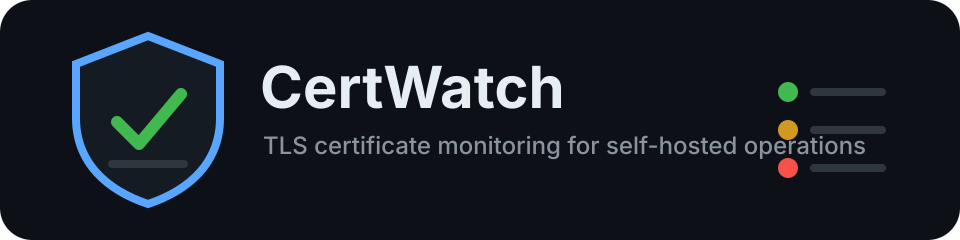

<p align="center">
  
</p>

# CertWatch

CertWatch is a self-hosted monitoring service for SSL/TLS certificates, TLS service configuration, and lightweight service health checks. It is intentionally similar in operating style to Uptime Kuma, but focused on certificate expiry, hostname mismatches, certificate chain issues, STARTTLS services, protocol availability, and alert deduplication.

The codebase is deliberately simple and compact. It also shows the signs of a fast AI-assisted build, so review the security and operational defaults before exposing it beyond a trusted network.

## Stack Decision

- Backend: Node.js with TypeScript and Express
- Frontend: React with Vite
- Database: SQLite by default through a small repository layer, with a structure that can later be adapted for PostgreSQL
- Worker: in-process scheduler with bounded concurrent checks
- Deployment: one Docker image served on port `8080`

This stack keeps the application easy to self-host while still supporting real TLS checks, background jobs, API endpoints, and a modern UI.

## Features

- Dashboard with OK, warning, critical, down, paused, and unknown status counts
- Monitor types for HTTPS, custom TCP TLS, SMTPS, IMAPS, POP3S, LDAPS, implicit FTPS, XMPP TLS, SMTP STARTTLS, IMAP STARTTLS, POP3 STARTTLS, and explicit FTP AUTH TLS
- Service health checks for HTTP, HTTP login flows, raw TCP ports, DNS records, SSH, FTP, SMTP, IMAP, and POP3 banners
- Optional service login checks for HTTP Basic/Form, SSH password auth, FTP, SMTP AUTH LOGIN, IMAP LOGIN, and POP3 USER/PASS
- Per-monitor alert grace period before failed checks create notifications
- Label-based application rollups where one service can contain multiple checks
- Prometheus-compatible metrics at `/metrics`
- SSL Labs-style TLS security grading with a compact A-F score per TLS result
- Flapping detection for monitors that repeatedly bounce between healthy and failed states
- Incident timelines for monitors and public status pages
- Public status page subscriptions through email or webhook callbacks
- Certificate Transparency watch for detecting newly issued certificates on watched domains
- Auto-discovery suggestions for common web and mail endpoints from a domain
- Backup and restore UI for portable, non-secret JSON exports
- Certificate detail view with CN, SANs, issuer, serial number, SHA256 fingerprint, validity, chain, TLS version, and cipher suite
- Hostname mismatch, self-signed, expiry, weak TLS protocol, chain trust, and fingerprint-change detection
- Historical check results per monitor
- Manual "check now" action and automatic periodic scheduler
- Global and per-monitor warning and critical expiry thresholds
- Notification channels for SMTP email, Pushover, generic webhooks, Discord, Slack, Telegram, Gotify, ntfy-compatible endpoints, Microsoft Teams, Mattermost, Matrix, PagerDuty, and Opsgenie
- Alert deduplication with resend interval, route-specific escalation delay, recovery messages, quiet hours, and per-monitor grace periods
- Enforced monitor and label-based maintenance windows that keep checks running while suppressing notifications
- Incident acknowledgement, assignment, notes, and delivery visibility for alert troubleshooting
- API tokens with read-only or read/write scopes for automation
- Custom public status pages with slugs, titles, descriptions, logos, hostname hiding, subscriptions, and incident timelines
- Scheduled auto-discovery jobs for common web and mail endpoints
- Availability reports with check counts, incident counts, availability percentage, and MTTR
- Scheduled SQLite database backups with UI download and retention controls
- Local user login with bcrypt password hashes, secure sessions, CSRF token header, and first-run admin setup
- Encrypted storage for monitor login secrets, SMTP settings, and notification provider secrets using `SESSION_SECRET`
- JSON monitor import/export and CSV exports for certificate summary and check history
- REST API under `/api`
- Dark and light mode
- Reverse-proxy aware deployment settings

## Screenshots

Screenshots are not committed yet. Start the app and open `http://localhost:8080` to capture:

- Dashboard
- Monitor detail page
- Monitor form
- Notification channel settings

## Quick Start

For a fresh Linux server with Docker already installed, run:

```bash
curl -fsSL https://raw.githubusercontent.com/brightcolor/certwatch/main/scripts/quickstart.sh | sudo bash
```

The script clones the repository into `/opt/certwatch`, creates `/opt/certwatch/.env` with generated secrets, creates a local `data` bind-mount directory, builds the image, and starts the stack with Docker Compose.

If the repository is private, use a GitHub token that can read the repository:

```bash
curl -fsSL -H "Authorization: Bearer ${GITHUB_TOKEN}" https://raw.githubusercontent.com/brightcolor/certwatch/main/scripts/quickstart.sh | sudo bash
```

Optional overrides:

```bash
curl -fsSL https://raw.githubusercontent.com/brightcolor/certwatch/main/scripts/quickstart.sh | sudo CERTWATCH_PORT=8080 bash
```

To publish CertWatch on a different host port, set `CERTWATCH_PORT`:

```bash
curl -fsSL https://raw.githubusercontent.com/brightcolor/certwatch/main/scripts/quickstart.sh | sudo CERTWATCH_PORT=8888 bash
```

For manual installs, use `HOST_PORT=8888` in `.env` and keep `PORT=8080` unless you intentionally want to change the internal application port too.

Manual setup:

1. Copy the environment file:

```bash
cp .env.example .env
```

2. Edit `.env` and set at least:

```bash
SESSION_SECRET=use-a-long-random-secret
BASE_URL=http://localhost:8080
```

3. Start CertWatch:

```bash
docker compose up -d
```

4. Open:

```text
http://localhost:8080
```

On first launch, CertWatch shows a setup screen where the first user creates the administrator account.

## Example Monitors

- `example.com`, port `443`, type `HTTPS`
- `smtp.example.com`, port `465`, type `SMTPS`
- `mail.example.com`, port `993`, type `TCP TLS`
- `ldap.example.com`, port `636`, type `LDAPS`
- `ftp.example.com`, port `21`, type `FTP explicit TLS`
- `smtp.example.com`, port `587`, type `SMTP STARTTLS`
- `imap.example.com`, port `143`, type `IMAP STARTTLS`
- `pop3.example.com`, port `110`, type `POP3 STARTTLS`
- `app.example.com`, port `443`, type `HTTP login check`
- `ssh.example.com`, port `22`, type `SSH banner`
- `example.com`, port `53`, type `DNS record check`

Use the same label on related monitors to model one application with multiple checks, for example `mail` on DNS, SMTP STARTTLS, IMAP STARTTLS, and webmail login monitors.

## Service Checks

CertWatch can monitor certificate-focused targets and general service availability from the same monitor list.

- HTTP checks validate the status code and can optionally require a response substring.
- HTTP login checks support Basic Auth or form POST checks. Login credentials are encrypted at rest and masked in API/UI responses.
- TCP checks validate that a port accepts connections.
- DNS checks validate record resolution and can require an expected value.
- SSH, FTP, SMTP, IMAP, and POP3 checks validate the protocol banner or capability response.
- Service login checks can validate credentials. SSH uses the SSH protocol; plain FTP, SMTP, IMAP, and POP3 login tests require explicit plaintext approval on the monitor. Prefer TLS or STARTTLS variants for credential-bearing checks.
- STARTTLS checks for SMTP, IMAP, and POP3 can optionally validate login credentials after the TLS upgrade.
- Direct SSL/TLS checks remain available for SMTPS, IMAPS, POP3S, LDAPS, implicit FTPS, and custom TLS ports.
- Explicit TLS upgrade checks are available for SMTP, IMAP, POP3, and FTP.

Keep `SESSION_SECRET` stable after first deployment. It is used to decrypt stored service-login passwords and provider secrets.
Monitor JSON exports mask stored secrets and are suitable for moving monitor definitions, not for full secret-bearing backups.

## Notification Setup

Notification providers are configured in the Settings page. Global SMTP settings live in the UI, while recipients are assigned per monitor or through notification routes. This keeps server/provider credentials separate from the people, rooms, chat IDs, or webhook targets that should receive a specific alert.

Routes can match labels, severity, and provider targets. Each route can also define an escalation delay, so a route can notify a primary recipient immediately and a second recipient only after the problem remains unresolved for a configured time.

Webhook payloads include monitor ID, monitor name, host, port, status, severity, message, days remaining, validity dates, issuer, SHA256 fingerprint, check time, and the monitor URL.

## REST API

All API routes require login session authentication except `/api/auth/login`.

- `GET /api/monitors`
- `POST /api/monitors`
- `GET /api/monitors/{id}`
- `PUT /api/monitors/{id}`
- `DELETE /api/monitors/{id}`
- `POST /api/monitors/{id}/check`
- `GET /api/monitors/{id}/results`
- `GET /api/status`
- `GET /api/alerts`
- `GET /api/incidents`
- `GET /api/subscriptions`
- `POST /api/notification-channels/test`
- `POST /api/discover`
- `GET /api/reports/availability`
- `GET /api/deliveries`
- `GET /api/api-tokens`
- `GET /api/settings/ct-watch`
- `PUT /api/settings/ct-watch`
- `GET /api/settings/maintenance`
- `GET /api/settings/tls-policy`
- `GET /api/settings/status-pages`
- `GET /api/settings/discovery`
- `GET /api/settings/backups`
- `POST /api/ct-watch/check`
- `POST /api/backups/run`
- `GET /api/export/monitors.json`
- `POST /api/export/monitors.json`
- `GET /api/export/backup.json`
- `POST /api/export/restore`
- `GET /api/export/certificates.csv`
- `GET /api/export/history.csv`

## Public Status And Badges

Public status pages are available by label/tag:

```text
/public/status/prod.html
/public/status/prod
/public/status/prod+mail.html
/public/status/prod+mail
```

Monitor badges are SVG URLs:

```text
/public/badge/{monitorId}.svg
/public/badge/tags/prod+mail.svg
```

Status pages include the latest incident timeline and expose a simple email/webhook subscription form. Subscriptions are notified when an incident opens or resolves for matching labels.

Custom status pages can be configured in the Operations page. A custom page maps a public slug to one or more labels and can set a title, description, logo URL, and hostname-hiding behavior.

## Operations

The Operations page contains production controls that are intentionally kept out of config files:

- Maintenance windows for labels or individual monitors. Supported formats include `daily 22:00-23:00`, `mon-fri 01:00-02:00`, and ISO intervals such as `2026-06-01T20:00:00/2026-06-01T22:00:00`.
- TLS policy profiles for grading, including minimum TLS version, weak cipher penalty, and SAN requirements.
- Scheduled discovery for web and mail endpoints.
- Scheduled SQLite backups with retention and downloadable backup files.
- API tokens with read-only or read/write scopes.
- Notification delivery log for sent and failed provider deliveries.

Monitor labels are entered as chips in the monitor form. Press Enter to add a label, click a label to remove it, or switch to text mode when labels need to be copied or pasted in bulk.

## Prometheus

Scrape:

```text
http://localhost:8080/metrics
```

Exported metrics include `certwatch_monitor_status`, `certwatch_cert_days_remaining`, `certwatch_last_check_timestamp`, and `certwatch_check_duration_seconds`.

## Watchtower Updates

The Compose file uses the published image `ghcr.io/brightcolor/certwatch:latest` and includes an optional Watchtower service. Enable it during quickstart:

```bash
curl -fsSL https://raw.githubusercontent.com/brightcolor/certwatch/main/scripts/quickstart.sh | sudo CERTWATCH_ENABLE_WATCHTOWER=true bash
```

Or enable it later:

```bash
cd /opt/certwatch
docker compose --profile watchtower up -d watchtower
```

Watchtower updates containers that have `com.centurylinklabs.watchtower.enable=true`.

## Reverse Proxy

Set:

```env
BASE_URL=https://certwatch.example.com
TRUST_PROXY=true
COOKIE_SECURE=true
```

Example nginx config:

```nginx
server {
  listen 443 ssl http2;
  server_name certwatch.example.com;

  location / {
    proxy_pass http://127.0.0.1:8080;
    proxy_set_header Host $host;
    proxy_set_header X-Real-IP $remote_addr;
    proxy_set_header X-Forwarded-For $proxy_add_x_forwarded_for;
    proxy_set_header X-Forwarded-Proto https;
  }
}
```

## Backups

The Import page includes a backup and restore UI for portable JSON exports of monitor definitions, provider definitions, notification routes, CT-watch settings, and non-secret settings. Secrets are masked in this export by design and must be re-entered after restore.

SQLite data is stored in the host bind mount configured by `DATA_DIR` and mounted into the container at `/data`. The default is `./data`, so manual installs store the database under the repository checkout. For a full secret-bearing backup, back up `certwatch.sqlite` and its WAL files while the container is stopped, or use a SQLite online backup command from a maintenance shell.

The Operations page can also create and retain full SQLite backup files inside `/data/backups`. These backups can be downloaded from the UI and are controlled by a keep-count retention setting.

## Updates

```bash
docker compose pull
docker compose build
docker compose up -d
```

The schema migration currently creates missing tables only. Back up the database before upgrading.

## Troubleshooting

- Login fails on a fresh install: open the setup screen and create the first admin user. For an existing install, reset the password in the SQLite database or recreate the bind-mounted data directory if no data must be kept.
- Checks fail for private hosts: set `ALLOW_PRIVATE_TARGETS=true` if the instance is intentionally allowed to monitor internal networks.
- Cookies fail behind HTTPS: set `COOKIE_SECURE=true` and ensure `X-Forwarded-Proto` is passed by the proxy.
- STARTTLS fails: verify the service advertises STARTTLS and that firewalls allow the configured port.
- Stored secrets cannot be read after changing `SESSION_SECRET`: restore the previous secret or re-enter affected monitor, SMTP, and notification provider passwords.

## TODO

- Add API token management
- Add full quiet-hours and maintenance-window enforcement
- Add OIDC, LDAP, and reverse-proxy-auth integrations
