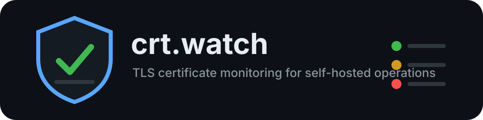

<p align="center">
  
</p>

# crt.watch

crt.watch is a self-hosted monitoring service for SSL/TLS certificates, TLS service configuration, and lightweight service health checks. It is intentionally similar in operating style to Uptime Kuma, but focused on certificate expiry, hostname mismatches, certificate chain issues, STARTTLS services, protocol availability, and alert deduplication.

The codebase is deliberately simple and compact. It also shows the signs of a fast AI-assisted build, so review the security and operational defaults before exposing it beyond a trusted network.

## Stack Decision

- Backend: Node.js with TypeScript and Express
- Frontend: React with Vite, Bootstrap 5.3/AdminLTE, Bootstrap Icons, and a small custom soft-UI layer
- Database: SQLite by default through a small repository layer, with a structure that can later be adapted for PostgreSQL
- Worker: in-process scheduler with bounded concurrent checks
- Deployment: one Docker image served on port `8080`

This stack keeps the application easy to self-host while still supporting real TLS checks, background jobs, API endpoints, and a modern UI.

## Features

- Dashboard with OK, warning, critical, down, paused, and unknown status counts
- Public frontpage that explains crt.watch before operators sign in, controlled by `FRONT_PAGE_ENABLED`
- Dark, colorful dashboard with a contextual health header, grouped checklist rows, color-coded multi-select status filters, and monitor cloning
- Collapsible AdminLTE sidebar that can shrink to icon-only navigation while keeping labels available on hover
- Live-refreshing UI views that update visible status, monitor details, operations, reports, users, workspaces, and settings without a manual reload
- Dashboard problem chips that show certificate, TLS, DNS, SSL Labs, and service issues directly in the monitor overview
- SaaS-ready workspace model with tenant-scoped monitors, notification providers, settings, public registration, invite links, permission groups, and role-based memberships
- Super admin user management with UI-controlled public registration, user creation, password rotation, platform roles, workspace assignment on creation, and support impersonation
- Dynamic browser favicon that glows green when healthy and blinks red when attention is required
- Monitor types for HTTPS, custom TCP TLS, SMTPS, IMAPS, POP3S, LDAPS, implicit FTPS, XMPP TLS, SMTP STARTTLS, IMAP STARTTLS, POP3 STARTTLS, and explicit FTP AUTH TLS
- Service health checks for HTTP, HTTP login flows, raw TCP ports, DNS records, SSH, FTP, SMTP, IMAP, and POP3 banners
- TCP, FTP, SMTP, IMAP, and POP3 service checks can use Auto, STARTTLS, SSL/TLS, or Plain transport security from the web UI
- Plain service health checks are clearly separated from secure transport checks so certificate fields are only shown when certificate data is collected
- Optional service login checks for HTTP Basic/Form, SSH password auth, and FTP, SMTP, IMAP, and POP3 credentials over STARTTLS, direct SSL/TLS, or explicitly allowed plaintext
- Per-monitor alert grace period before failed checks create notifications
- Label-based application rollups where one service can contain multiple checks
- Label inputs support chip mode, paste-friendly text mode, Enter/comma commits, and reliable blur commits before moving to another field
- Prometheus-compatible metrics at `/metrics`
- SSL Labs-style TLS security grading with a compact A-F score per TLS result, including secure service checks on the dashboard overview
- Optional intensive TLS assessment that probes supported TLS versions and flags deprecated protocol support, weak cipher patterns, missing forward secrecy, small certificate keys, and incomplete chains
- TLS grading explains persisted score deductions and deterioration alerts include the concrete reason for a grade drop
- Optional external Qualys SSL Labs v4 assessments for public HTTPS hosts on port `443`, cached per host for at least 24 hours
- Manual SSL Labs trigger from Operations or eligible monitor detail pages, with the resulting grade stored in monitor history
- Configurable notifications when a monitor's TLS grade or score deteriorates compared with the previous check
- Flapping detection for monitors that repeatedly bounce between healthy and failed states
- Incident timelines for monitors and public status pages
- Public status page subscriptions through email or webhook callbacks
- Certificate Transparency watch for detecting newly issued certificates on watched domains
- Auto-discovery suggestions for common web and mail endpoints from a domain
- Discovery results can be accepted one by one or imported all at once; MX-derived suggestions receive `mail` and `mx` labels
- Backup and restore UI for portable, non-secret JSON exports
- Certificate detail view with CN, SANs, issuer, serial number, SHA256 fingerprint, validity, chain, TLS version, and cipher suite
- DNS resolution details in monitor views, including fresh resolved IPs, authoritative nameservers, and comparison against Cloudflare, Quad9, and Google public resolvers on every check
- Hostname mismatch, self-signed, expiry, weak TLS protocol, chain trust, and fingerprint-change detection
- Optional DNS resolution change alerts based on uncached resolver comparisons
- Historical check results per monitor
- Manual "check now" action and automatic periodic scheduler
- Global and per-monitor warning and critical expiry thresholds
- Notification channels for SMTP email, Pushover, generic webhooks, Discord, Slack, Telegram, Gotify, ntfy-compatible endpoints, Microsoft Teams, Mattermost, Matrix, PagerDuty, and Opsgenie
- Alert deduplication with resend interval, route-specific escalation delay, recovery messages, quiet hours, and per-monitor grace periods
- Personal user alert preferences for warning, recovery, and info events while critical alerts stay controlled by workspace admin routes
- Certificate change alerting can be controlled globally and per monitor
- Enforced monitor and label-based maintenance windows that keep checks running while suppressing notifications
- Incident acknowledgement, assignment, notes, and delivery visibility for alert troubleshooting
- API tokens with read-only or read/write scopes for automation
- Custom public status pages with slugs, titles, descriptions, logos, hostname hiding, subscriptions, and incident timelines
- Public status page subscriptions require double opt-in before email or webhook incident updates are enabled
- Scheduled auto-discovery jobs for common web and mail endpoints
- Availability reports with check counts, incident counts, availability percentage, and MTTR
- Scheduled SQLite database backups with UI download and retention controls
- Local user login with bcrypt password hashes, secure sessions, CSRF token header, first-run admin setup, and organization self-registration
- Admin-only user management with visible validation for password length and duplicate email addresses
- Workspace roles for `owner`, `admin`, `member`, and `viewer`, plus workspace permission groups that grant an effective per-organization role; existing self-hosted installs are migrated into a default workspace
- Encrypted storage for monitor login secrets, SMTP settings, and notification provider secrets using `SESSION_SECRET`
- JSON monitor import/export and CSV exports for certificate summary and check history
- REST API under `/api`
- Dark, bright, and auto color modes with a Discord-like neutral gray default and no decorative color accent outside status signals
- AdminLTE 4.0.0-based operator interface with sidebar navigation, status center, global monitor search, Bootstrap-style cards, and responsive admin forms
- Maintenance windows can be built with datetime pickers and still support text rules for recurring windows
- Status pills, rows, dashboard cards, and status center counters use clear green, yellow, red, and gray signal colors
- Cleaner responsive form layouts with aligned labels and controls
- UI and public status dates use leading zeroes for day and month
- Reverse-proxy aware deployment settings

## Screenshots

Screenshots are not committed yet. Start the app and open `http://localhost:8080` to capture:

- Dashboard
- Monitor detail page
- Monitor form
- Notification channel settings

## Quick Start

For a fresh Linux server with Docker already installed, run:

```bash
curl -fsSL https://raw.githubusercontent.com/brightcolor/crt.watch/main/scripts/quickstart.sh | sudo bash
```

The script clones the current GitHub repository into `/opt/crt.watch`, creates `/opt/crt.watch/.env` with generated secrets, creates a local `data` bind-mount directory, pulls the published GHCR image, and starts the stack with Docker Compose.

If the repository is private, use a GitHub token that can read the repository:

```bash
curl -fsSL -H "Authorization: Bearer ${GITHUB_TOKEN}" https://raw.githubusercontent.com/brightcolor/crt.watch/main/scripts/quickstart.sh | sudo bash
```

Optional overrides:

```bash
curl -fsSL https://raw.githubusercontent.com/brightcolor/crt.watch/main/scripts/quickstart.sh | sudo CRTWATCH_PORT=8080 bash
```

To publish crt.watch on a different host port, set `CRTWATCH_PORT`:

```bash
curl -fsSL https://raw.githubusercontent.com/brightcolor/crt.watch/main/scripts/quickstart.sh | sudo CRTWATCH_PORT=8888 bash
```

For manual installs, use `HOST_PORT=8888` in `.env` and keep `PORT=8080` unless you intentionally want to change the internal application port too.
Persistent data is mounted from `DATA_DIR`, which defaults to `./data` relative to the Compose project directory.

Manual setup:

1. Copy the environment file:

```bash
cp .env.example .env
```

2. Edit `.env` and set at least:

```bash
SESSION_SECRET=use-a-long-random-secret
BASE_URL=http://localhost:8080
```

3. Start crt.watch:

```bash
docker compose up -d
```

4. Open:

```text
http://localhost:8080
```

On first launch, crt.watch shows a setup screen where the first user creates the administrator account.

The public marketing frontpage is enabled by default. Disable it with `FRONT_PAGE_ENABLED=false` when crt.watch should open directly on the sign-in screen. Public organization signup is controlled separately with `PUBLIC_REGISTRATION_ENABLED`; invitation links keep working even when public signup is disabled.

For local development, the Vite frontend runs on `http://localhost:5173` and proxies `/api`, `/metrics`, and `/public` to the API server on `http://localhost:8080`.

## Example Monitors

- `example.com`, port `443`, type `HTTPS`
- `smtp.example.com`, port `465`, type `SMTPS`
- `mail.example.com`, port `993`, type `TCP TLS`
- `ldap.example.com`, port `636`, type `LDAPS`
- `ftp.example.com`, port `21`, type `FTP explicit TLS`
- `smtp.example.com`, port `587`, type `SMTP STARTTLS`
- `imap.example.com`, port `143`, type `IMAP STARTTLS`
- `pop3.example.com`, port `110`, type `POP3 STARTTLS`
- `app.example.com`, port `443`, type `HTTP login check`
- `ssh.example.com`, port `22`, type `SSH banner`
- `example.com`, port `53`, type `DNS record check`

Use the same label on related monitors to model one application with multiple checks, for example `mail` on DNS, SMTP STARTTLS, IMAP STARTTLS, and webmail login monitors.

## Service Checks

crt.watch can monitor certificate-focused targets and general service availability from the same monitor list.

- HTTP checks validate the status code and can optionally require a response substring.
- HTTP login checks support Basic Auth or form POST checks. Login credentials are encrypted at rest and masked in API/UI responses.
- TCP checks validate that a port accepts connections.
- DNS checks validate record resolution and can require an expected value.
- SSH, FTP, SMTP, IMAP, and POP3 checks validate the protocol banner or capability response.
- Service login checks can validate credentials. SSH uses the SSH protocol; plain FTP, SMTP, IMAP, and POP3 login tests require explicit plaintext approval on the monitor and do not collect X.509 certificate data. Prefer TLS or STARTTLS variants for credential-bearing checks and certificate details.
- STARTTLS checks for SMTP, IMAP, and POP3 can optionally validate login credentials after the TLS upgrade.
- FTP, SMTP, IMAP, POP3, and TCP service monitors have a Transport Security selector.
- `Auto` tries the best secure transport for the selected port, keeps certificate details when successful, and falls back to plain checks only when no secure transport works.
- `STARTTLS / explicit TLS` requires a protocol upgrade and fails the check if the server does not offer it.
- `SSL/TLS` requires an implicit TLS handshake on the configured port.
- `Plain` verifies availability or credentials only and never collects X.509 certificate details.
- STARTTLS and direct SSL/TLS FTP, SMTP, IMAP, and POP3 checks can optionally validate login credentials after the TLS session is established.
- Direct SSL/TLS checks remain available for SMTPS, IMAPS, POP3S, LDAPS, implicit FTPS, and custom TLS ports.
- Explicit TLS upgrade checks are available for SMTP, IMAP, POP3, and FTP.
- External SSL Labs assessments are an optional extra for public HTTPS hosts on port `443`. SSL Labs does not replace the local TLS/STARTTLS checks and is not used for private hosts, SMTP, IMAP, POP3, FTP, or arbitrary STARTTLS ports.

Keep `SESSION_SECRET` stable after first deployment. It is used to decrypt stored service-login passwords and provider secrets.
Monitor JSON exports mask stored secrets and are suitable for moving monitor definitions, not for full secret-bearing backups.

## Notification Setup

Notification providers are configured in the Settings page. Global SMTP settings live in the UI, while recipients are assigned per monitor or through notification routes. This keeps server/provider credentials separate from the people, rooms, chat IDs, or webhook targets that should receive a specific alert.

Routes can match labels, severity, and provider targets. Each route can also define an escalation delay, so a route can notify a primary recipient immediately and a second recipient only after the problem remains unresolved for a configured time.

Users can configure personal alert preferences for non-critical events in Settings. Personal preferences use the workspace's verified notification providers but can set the user's own recipient target, such as an email address, chat ID, or room ID. Critical alerts intentionally ignore personal preferences and always follow the workspace admin-defined monitor recipients and notification routes.

Webhook payloads include monitor ID, monitor name, host, port, status, severity, message, days remaining, validity dates, issuer, SHA256 fingerprint, local TLS grade, optional SSL Labs grade, resolved addresses, DNS resolver mismatches, check time, and the monitor URL.

## REST API

All API routes require login session authentication except `/api/auth/login`.

- `GET /api/monitors`
- `POST /api/monitors`
- `GET /api/monitors/{id}`
- `PUT /api/monitors/{id}`
- `DELETE /api/monitors/{id}`
- `POST /api/monitors/{id}/check`
- `GET /api/monitors/{id}/results`
- `GET /api/status`
- `GET /api/alerts`
- `GET /api/incidents`
- `GET /api/subscriptions`
- `POST /api/notification-channels/test`
- `POST /api/discover`
- `POST /api/discovery/import`
- `GET /api/reports/availability`
- `GET /api/deliveries`
- `GET /api/api-tokens`
- `GET /api/settings/ct-watch`
- `PUT /api/settings/ct-watch`
- `GET /api/settings/maintenance`
- `GET /api/settings/tls-policy`
- `GET /api/settings/ssl-labs`
- `POST /api/ssl-labs/trigger`
- `GET /api/settings/status-pages`
- `GET /api/settings/discovery`
- `GET /api/settings/backups`
- `POST /api/ct-watch/check`
- `POST /api/backups/run`
- `GET /api/export/monitors.json`
- `POST /api/export/monitors.json`
- `GET /api/export/backup.json`
- `POST /api/export/restore`
- `GET /api/export/certificates.csv`
- `GET /api/export/history.csv`

## Public Status And Badges

Public status pages are available by label/tag:

```text
/public/status/prod.html
/public/status/prod
/public/status/prod+mail.html
/public/status/prod+mail
```

Monitor badges are SVG URLs:

```text
/public/badge/{monitorId}.svg
/public/badge/tags/prod+mail.svg
```

Badges size themselves from their content, keep long hostnames clipped inside the label area, and expose a `viewBox` for responsive embedding. Add a custom public label or short alias with `?label=Mail` or `?alias=Mail`:

```text
/public/badge/{monitorId}.svg?label=Mail
/public/badge/tags/prod+mail.svg?alias=Customer%20Mail
```

Status pages include the latest incident timeline and expose a simple email/webhook subscription form. Subscriptions are notified when an incident opens or resolves for matching labels.

Custom status pages can be configured in the Operations page. A custom page maps a public slug to one or more labels and can set a title, description, logo URL, and hostname-hiding behavior.

Public status page subscriptions are inactive until the recipient confirms the opt-in link. Email subscriptions receive a confirmation email through the global SMTP settings. Webhook subscriptions receive a JSON opt-in payload with `confirm_url`.

## Operations

The Operations page contains production controls that are intentionally kept out of config files:

- Maintenance windows for labels or individual monitors. Supported formats include `daily 22:00-23:00`, `mon-fri 01:00-02:00`, and ISO intervals such as `2026-06-01T20:00:00/2026-06-01T22:00:00`.
- TLS policy profiles for grading, including minimum TLS version, weak cipher penalty, and SAN requirements.
- Intensive TLS probing can be enabled in Operations. It performs additional handshakes to detect supported TLS versions and feeds those findings into the grade.
- SSL Labs external assessment can be enabled in Operations with a registered SSL Labs API email. There is no API key field; SSL Labs v4 expects the registered organization email in the `email` header. The Operations UI can submit the one-time SSL Labs API registration for first name, last name, email, and organization, then save the email for future assessments. Operators can also trigger a manual assessment from Operations or an eligible HTTPS monitor detail page. crt.watch respects the scheduled minimum 24-hour per-host interval and lets manual triggers choose cached or fresh SSL Labs scans.
- Alert policy can notify on TLS grade or score deterioration. The score-drop threshold controls how sensitive these alerts are.
- Alert policy can notify on certificate changes and DNS resolution changes. Individual monitors can override both policies. DNS resolver comparisons are intentionally uncached and run fresh on each monitor check.
- Scheduled discovery for web and mail endpoints, with direct accept buttons for individual suggestions or all suggestions.
- Scheduled SQLite backups with retention and downloadable backup files.
- API tokens with read-only or read/write scopes.
- Notification delivery log for sent and failed provider deliveries.

Monitor labels are entered as chips in the monitor form. Press Enter or comma to add a label, move to another field to commit the current label on blur, click a label to remove it, or switch to text mode when labels need to be copied or pasted in bulk.

The Settings page includes the remaining interface preference for dark or light mode. AdminLTE 4 is the single frontend shell, so operators get one consistent navigation, status center, global monitor search, card layout, and form system.

## SaaS Readiness

crt.watch now has a workspace layer that prepares the app for SaaS operation:

- Each authenticated request is scoped to the selected workspace through the `X-Tenant-Id` header.
- Team context is selected with `X-Team-Id` and verified server-side against the active workspace membership.
- Monitors, notification providers, alert policy, SMTP settings, TLS policy, discovery, status page settings, and backups are tenant-scoped.
- Workspace memberships support `owner`, `admin`, `member`, and `viewer` roles.
- Workspaces can contain tenant-scoped teams with `team_owner`, `team_admin`, and `team_member` roles. Private teams are visible to members, while tenant-visible teams are readable by the whole workspace.
- Public registration creates an isolated organization workspace for the new user when `PUBLIC_REGISTRATION_ENABLED=true`.
- Owners and workspace admins can invite users by email with an explicit workspace role. If no role is selected, invites default to `viewer`.
- The same user can belong to several organizations with different direct roles, for example admin in one workspace and viewer in another.
- Workspace permission groups can grant additional roles to multiple members. The effective role is the highest direct or group role inside that organization.
- Viewers can read workspace data, members can operate monitors, and owners/admins can manage settings, providers, teams, access groups, invites, and members.
- The last active workspace owner and the last active team owner are protected from accidental removal or demotion.
- Invite tokens are hashed at rest. The raw invite URL is shown when an invite is created and is not reconstructed from stored hashes later.
- Tenants include plan, status, monitor limit, user limit, and team limit fields so billing or subscription logic can be added later.

Billing, automated invite emails, team-scoped monitor ownership, and per-tenant custom domains are intentionally not included yet.

## Prometheus

Scrape:

```text
http://localhost:8080/metrics
```

Exported metrics include `crtwatch_monitor_status`, `crtwatch_cert_days_remaining`, `crtwatch_last_check_timestamp`, and `crtwatch_check_duration_seconds`.

## Watchtower Updates

The Compose file uses the published image `ghcr.io/brightcolor/crt-watch:latest` and does not start its own Watchtower container. This keeps updates under your existing external Watchtower instance.

The crt.watch service keeps `com.centurylinklabs.watchtower.enable=true`, so an external Watchtower running with `--label-enable` can update it automatically.

## Local Image Builds

The production Compose file intentionally does not contain `build:` so self-hosted installs and external Watchtower deployments always use the published GHCR image. It uses compact Compose syntax and a relative bind mount by default. To build locally from the repository, use the development override:

```bash
docker compose -f docker-compose.yml -f docker-compose.dev.yml up -d --build
```

## Reverse Proxy

Set:

```env
BASE_URL=https://crt.watch.example.com
TRUST_PROXY=true
COOKIE_SECURE=true
```

Example nginx config:

```nginx
server {
  listen 443 ssl http2;
  server_name crt.watch.example.com;

  location / {
    proxy_pass http://127.0.0.1:8080;
    proxy_set_header Host $host;
    proxy_set_header X-Real-IP $remote_addr;
    proxy_set_header X-Forwarded-For $proxy_add_x_forwarded_for;
    proxy_set_header X-Forwarded-Proto https;
  }
}
```

## Backups

The Import page includes a backup and restore UI for portable JSON exports of monitor definitions, provider definitions, notification routes, CT-watch settings, and non-secret settings. Secrets are masked in this export by design and must be re-entered after restore.

SQLite data is stored in the host bind mount configured by `DATA_DIR` and mounted into the container at `/data`. The default is `./data`, so manual installs store the database under the repository checkout. For a full secret-bearing backup, back up `crtwatch.sqlite` and its WAL files while the container is stopped, or use a SQLite online backup command from a maintenance shell.

The Operations page can also create and retain full SQLite backup files inside `/data/backups`. These backups can be downloaded from the UI and are controlled by a keep-count retention setting.

## Updates

```bash
docker compose pull
docker compose up -d
```

The schema migration currently creates missing tables only. Back up the database before upgrading.

## Troubleshooting

- Login fails on a fresh install: open the setup screen and create the first admin user. For an existing install, reset the password in the SQLite database or recreate the bind-mounted data directory if no data must be kept.
- Creating a user fails: make sure the current account has the Admin role, the email address is not already used, and the password has at least 12 characters.
- Checks fail for private hosts: set `ALLOW_PRIVATE_TARGETS=true` if the instance is intentionally allowed to monitor internal networks.
- Cookies fail behind HTTPS: set `COOKIE_SECURE=true` and ensure `X-Forwarded-Proto` is passed by the proxy.
- STARTTLS fails: verify the service advertises STARTTLS and that firewalls allow the configured port.
- Stored secrets cannot be read after changing `SESSION_SECRET`: restore the previous secret or re-enter affected monitor, SMTP, and notification provider passwords.

## TODO

- Add API token management
- Add full quiet-hours and maintenance-window enforcement
- Add OIDC, LDAP, and reverse-proxy-auth integrations
